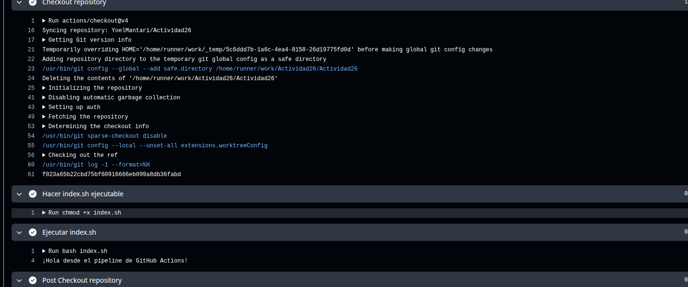

# actividad26

implementacion continua con github actions

## comandos para ejecutar

1. navegar al directorio del proyecto
```
cd /ruta/al/proyecto/Actividad26
```

2. dar permisos de ejecucion al script
```
chmod +x index.sh
```

3. ejecutar el script

```
./index.sh
```


## Implementacion continua
Se automatiza el proceso de despliegue de software que permite publicar cambios de forma rapida y confiable

**github actions**

servicio de automatizacion integrado en github que permite crear workflows para:
- compilar y probar codigo
- desplegar aplicaciones
- ejecutar tareas automatizadas
- validar cambios automaticamente

## estructura basica de workflows

los workflows en github actions incluyen:
- name: nombre descriptivo del workflow
- on: eventos que disparan la ejecucion
- jobs: conjunto de tareas que se ejecutan
- steps: pasos individuales dentro de cada job
- uses: acciones predefinidas del marketplace
- run: comandos de shell

## resultado esperado

Al ejecutar cualquiera desplegar en github se ejecutar en github actions el siguiente mensaje:



## Ejercicios

### Ejercicios teorico

**1. Que es github actions**

Github actions es una plataforma de automatizacion que permite crear workflows para compilar probar y desplegar codigo directamente desde github

**2. implementacion continua definicion**

La implementacion continua es la practica de automatizar todo el proceso de entrega de software desde el codigo hasta produccion

diferencias principales:
- Entrega continua: automatiza hasta estar listo para produccion pero requiere aprobacion manual para desplegar
- Despliegue continuo: automatiza completamente incluyendo el despliegue a produccion sin intervencion manual  
- Implementacion continua: combina ambas practicas con automatizacion completa y retroalimentacion constante

**3. ejemplo proyecto python**

archivo app.py:
```python
def main():
    print("hola desde mi aplicacion python")
    return "vers1"

if __name__ == "__main__":
    main()
```

workflow para pypi:
```yaml
      # 2) Configurar Python
      - name: Setup Python
        uses: actions/setup-python@v4
        with:
          python-version: "3.x"

      # 3) Damos permisos de ejecución al script
      - name: Hacer index.sh ejecutable
        run: chmod +x index.sh

      # 4) Ejecutamos nuestro script bash
      - name: Ejecutar index.sh
        run: bash index.sh

      # 5) Simular build de proyecto Python
      - name: Instalar dependencias de build
        run: pip install build twine

      # 6) Ejecutar el script Python
      - name: Ejecutar app.py
        run: python app.py

      # 7) Mostrar mensaje de deploy simulado
      - name: Deploy simulado
        run: echo "proceso de deploy completado listo para pypi"
```

Este workflow de GitHub Actions llamado CI se ejecuta automaticamente cada vez que haces push al repositorio, primero se descarga el código y configura python en un servidor Ubuntu. Luego da permisos y ejecuta el script bash index.sh, instala dependencias python, y luego ejecuta el archivo app.py y finalmente simula un proceso de deploy mostrando un mensaje de que está listo para PyPI.